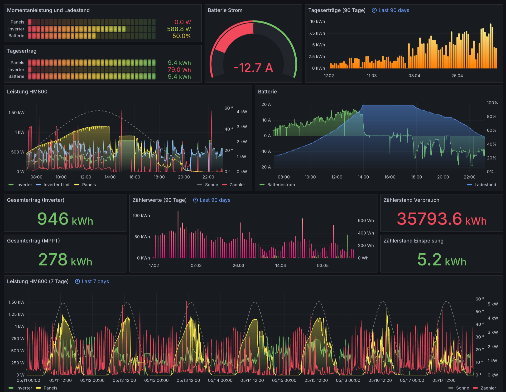

# Markus Solar Dashboard

If you like this, a small donation is appreciated:

[](https://ko-fi.com/R6R8DQO8C)

The Grafana dashboard I use for my PV tracking, made public by popular request. There is the original basic version for a non-storage solar system
as well as the 'on Battery' version now.

Battery version:


Basic version:


- this is not fancy or parameterized, so you will have to adjust the queries to match the params in your database
  - I write the units to InfluxDB as main selector (A, V, W, kWh, Wh, etc.)
  - then I use the entity_id to select which parameter out of the unit pool I want
- in my setup the Sun data is written to the InfluxDB by HomeAssistant, you can also use Grafanas Sun&Moon plugin to achieve the same
- the solar data is gathered via OpenDTU from Hoymiles Inverter and sent to HomeAssistant via MQTT, from there I write select data to InfluxDB
- the electricity meter data is gathered through a Tasmota+Hichi infrared reader and also received via MQTT in HomeAssistant, from there I forward some data to InfluxDB
- see [this config snippet](configurations_snippet.yaml) for how I run my Home Assistant to feed this dashboard, of course you need to adapt this for the values you have 

If using the 'on Battery' version, remember to add you battery and charge controller data topics to the influxdb-collection, e.g. like so:

```yaml
  include:
    domains:
      - sun
    entity_globs:
      - "*.hm800_*"
      - "*.pylontech_us5000_01*"
      - "*.victron*"
```

If you like what you see here, you can leave me a tip here:


